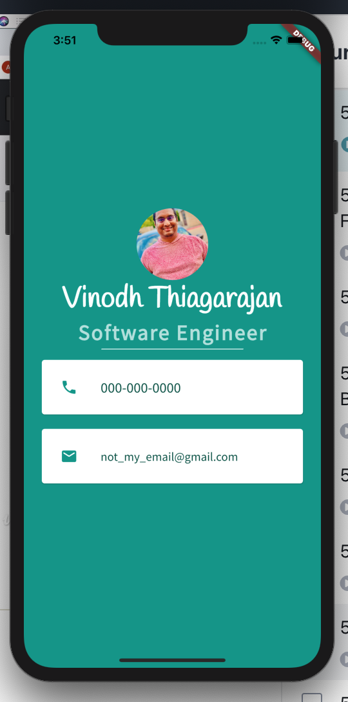

# Building a Sample Business Card using Flutter

A flutter app built using the following Widgets, Assets and other Flutter Properties,
  - Circle Avatar
  - Safe Area Widget
  - Column
  - Row
  - Card
  - Title
  - Padding
  - Image Asset
  - Font Asset

## Links useful to build this:

- [https://icons8.com/illustrations](https://icons8.com/illustrations)
- [https://www.vecteezy.com/](https://www.vecteezy.com/)
- [https://www.canva.com/](https://www.canva.com/)
- [http://fonts.google.com/](http://fonts.google.com/)
- [https://www.materialpalette.com/](https://www.materialpalette.com/)
- [https://www.materialpalette.com/icons](https://www.materialpalette.com/icons)
- [https://www.materialpalette.com/colors](https://www.materialpalette.com/colors)

## Layouts Reference and Terminologies:

- Cheat Sheet : [https://medium.com/flutter-community/flutter-layout-cheat-sheet-5363348d037e](https://medium.com/flutter-community/flutter-layout-cheat-sheet-5363348d037e)

    ### Terminologies:

    ### Container-Child-Children:

    A CONTAINER can have only one child but if you want to have multiple children you need to go with something called as **rows** and **columns**. ROWS are considered horizontal (RH) and COLUMNS are considered vertical (CV). rows and columns they'll have a property name children and  it will be of type  widget list. `children: <Widget>[] (<OTHER WIDGETs here>)`

    ### Margin and Padding:

    when you want to control the area outside and container it is called a margin then you want to control the elements position within the container it is called padding

    ### Sized Box:

    If you want to create a space between the containers within the rows or columns you can use something called as the sized box widget.Its just a place holder.

    ### Main and Cross Axis:

    There are two different kinds of Axis one is called the Main Axis the other one is called the Cross Axis. For A ROW which is actually a horizontal component the main axis is horizontal and cross axis is vertical but for a column the main axis is vertical and cross axis is horizontal

    ### Safe Area Widget:

    This is a widget which will set itself within the boundaries of any phone, so that it will not be hidden behind any phone specific external design.

    ## Challenges :

    ### Chapter 5:

    

